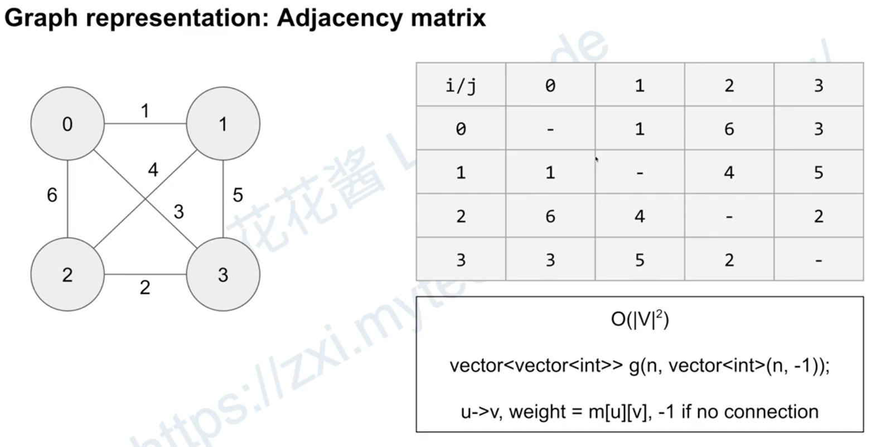
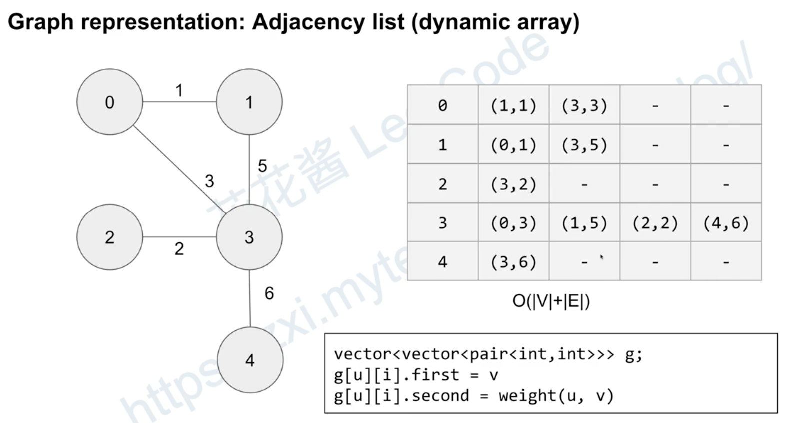
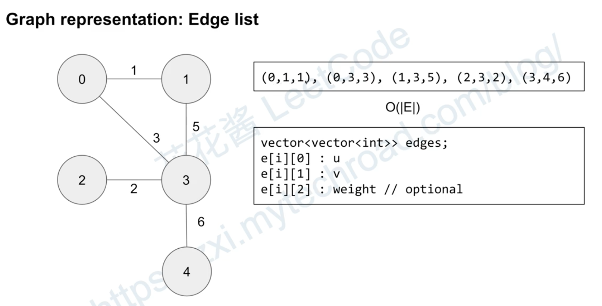
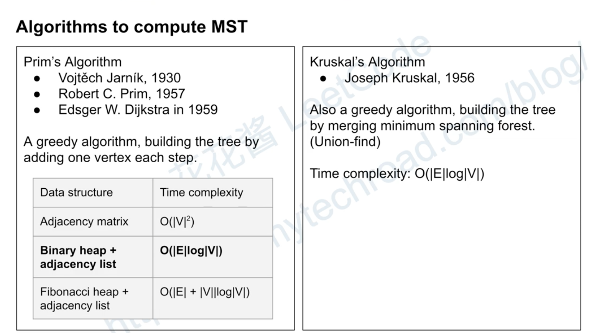
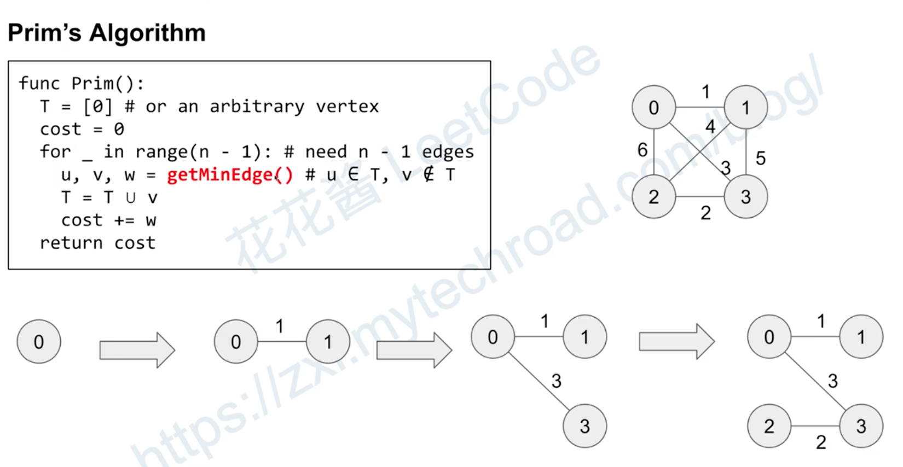
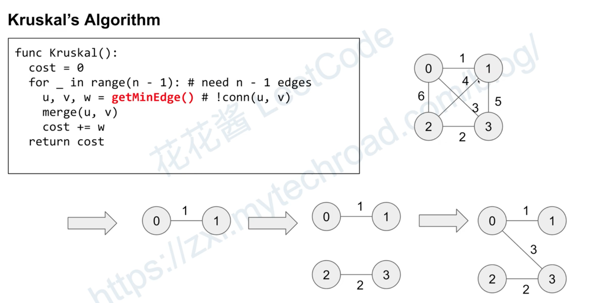

What is spanning tree?

What is Minimum Spanning Tree(MST)?
- 带权重的图
- 最小的权重图使得每个node都cover
- 可能有多个解

Nodes can be cities, edges can be always or cables. 
We want to minimize the cost to connect all cities. No redundancy

有个缺点，如果的mst的edge断掉, node 与node 就失去了联系

Graph representation: 

Kruskal Example

Given an undirected graph with n nodes labeled 1..n. Some of the nodes are already connected. The i-th edge connects nodes edges[i][0] and edges[i][1] together. Your task is to augment this set of edges with additional edges to connect all the nodes. Find the minimum cost to add new edges between the nodes such that all the nodes are accessible from each other.

Input:

n, an int representing the total number of nodes.
edges, a list of integer pair representing the nodes already connected by an edge.
newEdges, a list where each element is a triplet representing the pair of nodes between which an edge can be added and the cost of addition, respectively (e.g. [1, 2, 5] means to add an edge between node 1 and 2, the cost would be 5).
Example 1:

Input: n = 6, edges = [[1, 4], [4, 5], [2, 3]], newEdges = [[1, 2, 5], [1, 3, 10], [1, 6, 2], [5, 6, 5]]
Output: 7
Explanation:
There are 3 connected components [1, 4, 5], [2, 3] and [6].
We can connect these components into a single component by connecting node 1 to node 2 and node 1 to node 6 at a minimum cost of 5 + 2 = 7.

public class Main {
    public static void main(String[] args) {
        int n = 6;
        int[][] edges = {{1, 4}, {4, 5}, {2, 3}};
        int[][] newEdges = {{1, 2, 5}, {1, 3, 10}, {1, 6, 2}, {5, 6, 5}};
        System.out.println(minCost(n, edges, newEdges));
    }
    
    public static int minCost(int n, int[][] edges, int[][] newEdges) {
        UF uf = new UF(n + 1); // + 1 because nodes are 1-based
        for (int[] edge : edges) {
            uf.union(edge[0], edge[1]);
        }
        
        Queue<int[]> pq = new PriorityQueue<>(newEdges.length, (e1, e2) -> Integer.compare(e1[2], e2[2]));
        pq.addAll(Arrays.asList(newEdges));
        
        int totalCost = 0;
        // 2 because nodes are 1-based and we have 1 unused component at index 0
        while (!pq.isEmpty() && uf.count != 2) {
            int[] edge = pq.poll();
            if (!uf.connected(edge[0], edge[1])) {
                uf.union(edge[0], edge[1]);
                totalCost += edge[2];
            }
        }
        return totalCost;
    }
}

class UF {
    private int[] parent;  // parent[i] = parent of i
    private byte[] rank;   // rank[i] = rank of subtree rooted at i (never more than 31)
    public int count;      // number of connected components

    public UF(int n) {
        if (n < 0) throw new IllegalArgumentException();
        parent = new int[n];
        rank = new byte[n];
        for (int i = 0; i < n; i++) {
            parent[i] = i;
        }
        count = n;
    }

    public int find(int p) {
        while (p != parent[p]) {
            parent[p] = parent[parent[p]];
            p = parent[p];
        }
        return p;
    }

    public void union(int p, int q) {
        int pr = find(p);
        int qr = find(q);
        if (pr == qr) return;
        if (rank[pr] < rank[qr]) {
            parent[pr] = qr;
        } else {
            parent[qr] = pr;
            if (rank[pr] == rank[qr]) rank[pr]++;
        }
        count--;
    }

    public boolean connected(int p, int q) {
        return find(p) == find(q);
    }
}

