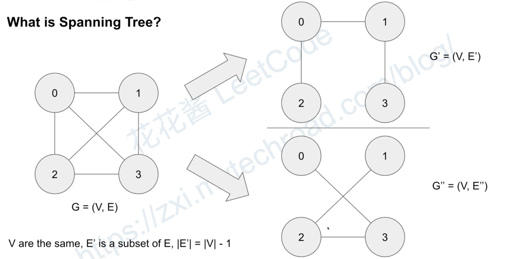

What is spanning tree?

What is Minimum Spanning Tree(MST)?
- 带权重的图
- 最小的权重图使得每个node都cover
- 可能有多个解

Nodes can be cities, edges can be always or cables. 
We want to minimize the cost to connect all cities. No redundancy

有个缺点，如果的mst的edge断掉, node 与node 就失去了联系

Graph representation: 

