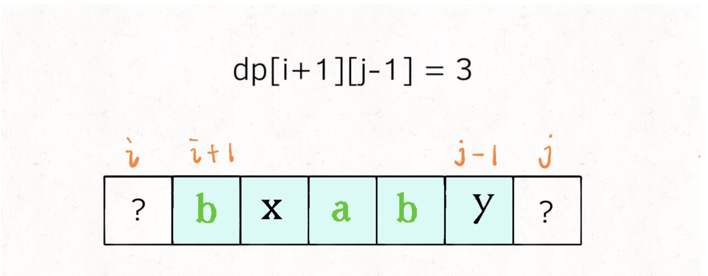
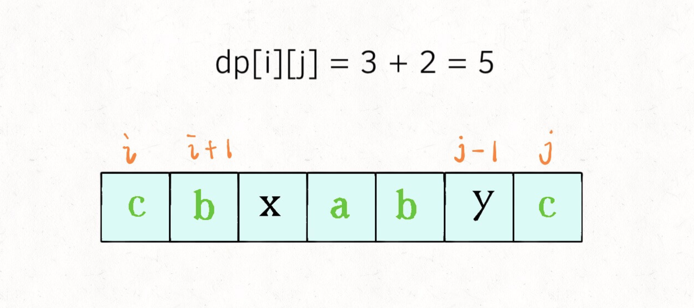
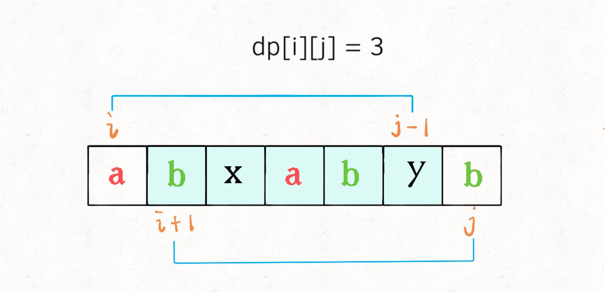

 dp 数组的定义是：在子串 s[i..j] 中，最长回文子序列的长度为 dp[i][j]。一定要记住这个定义才能理解算法。
 
 具体来说，如果我们想求 dp[i][j]，假设你知道了子问题 dp[i+1][j-1] 的结果（s[i+1..j-1] 中最长回文子序列的长度），
 你是否能想办法算出 dp[i][j] 的值（s[i..j] 中，最长回文子序列的长度）呢？
 
 
 
 这取决于 s[i] 和 s[j] 的字符：
如果它俩相等，那么它俩加上 s[i+1..j-1] 中的最长回文子序列就是 s[i..j] 的最长回文子序列：
 
 
 
 如果它俩不相等，说明它俩不可能同时出现在 s[i..j] 的最长回文子序列中，那么把它俩分别加入 s[i+1..j-1] 中，看看哪个子串产生的回文子序列更长即可：
 
 
 
 
状态转移：
if (s[i] == s[j])
    
    // 它俩一定在最长回文子序列中
    dp[i][j] = dp[i + 1][j - 1] + 2;
else
    
    // s[i+1..j] 和 s[i..j-1] 谁的回文子序列更长？
    dp[i][j] = max(dp[i + 1][j], dp[i][j - 1]);

base case:
如果只有一个字符，显然最长回文子序列长度是 1，也就是 dp[i][j] = 1 (i == j)。

代码

int longestPalindromeSubseq(string s) {
    int n = s.size();
    // dp 数组全部初始化为 0
    vector<vector<int>> dp(n, vector<int>(n, 0));
    // base case
    for (int i = 0; i < n; i++)
        dp[i][i] = 1;
    // 反着遍历保证正确的状态转移
    for (int i = n - 1; i >= 0; i--) {
        for (int j = i + 1; j < n; j++) {
            // 状态转移方程
            if (s[i] == s[j])
                dp[i][j] = dp[i + 1][j - 1] + 2;
            else
                dp[i][j] = max(dp[i + 1][j], dp[i][j - 1]);
        }
    }
    // 整个 s 的最长回文子串长度
    return dp[0][n - 1];
}

根据状态转移 写loop
