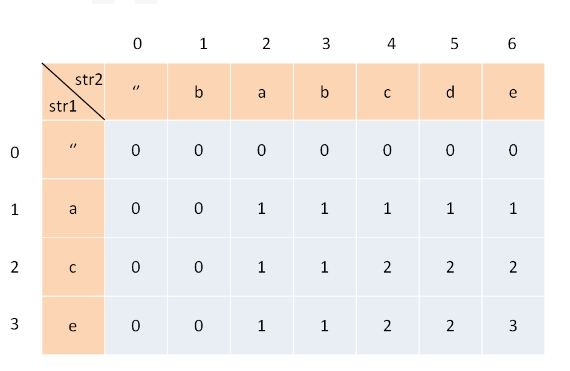
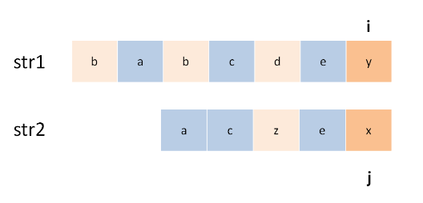

NOTE: 解决两个字符串的动态规划问题，一般都是用两个指针 i,j 分别指向两个字符串的最后，然后一步步往前走，缩小问题的规模。

经典动态规划：最长公共子序列

一定要明确 dp 数组的含义。对于两个字符串的动态规划问题，套路是通用的。
比如说对于字符串 s1 和 s2，一般来说都要构造一个这样的 DP table：

state: 上图

为了方便理解此表，我们暂时认为索引是从 1 开始的，待会的代码中只要稍作调整即可。其中，dp[i][j] 的含义是：对于 s1[1..i] 和 s2[1..j]，它们的 LCS 长度是 dp[i][j]。
比如上图的例子，d[2][4] 的含义就是：对于 "ac" 和 "babc"，它们的 LCS 长度是 2。我们最终想得到的答案应该是 dp[3][6]。

第二步，定义 base case。
我们专门让索引为 0 的行和列表示空串，dp[0][..] 和 dp[..][0] 都应该初始化为 0，这就是 base case。
比如说，按照刚才 dp 数组的定义，dp[0][3]=0 的含义是：对于字符串 "" 和 "bab"，其 LCS 的长度为 0。因为有一个字符串是空串，它们的最长公共子序列的长度显然应该是 0。

第三步，找状态转移方程。
状态转移说简单些就是做选择，比如说这个问题，是求 s1 和 s2 的最长公共子序列，不妨称这个子序列为 lcs。那么对于 s1 和 s2 中的每个字符，有什么选择？很简单，两种选择，要么在 lcs 中，要么不在。
这个「在」和「不在」就是选择，关键是，应该如何选择呢？这个需要动点脑筋：如果某个字符应该在 lcs 中，那么这个字符肯定同时存在于 s1 和 s2 中，因为 lcs 是最长公共子序列嘛。所以本题的思路是这样：
用两个指针 i 和 j 从后往前遍历 s1 和 s2，如果 s1[i]==s2[j]，那么这个字符一定在 lcs 中；否则的话，s1[i] 和 s2[j] 这两个字符至少有一个不在 lcs 中，需要丢弃一个。先看一下递归解法，比较容易理解：

def longestCommonSubsequence(str1, str2) -> int:
    def dp(i, j):
        # 空串的 base case
        if i == -1 or j == -1:
            return 0
        if str1[i] == str2[j]:
            # 这边找到一个 lcs 的元素，继续往前找
            return dp(i - 1, j - 1) + 1
        else:
            # 谁能让 lcs 最长，就听谁的
            return max(dp(i-1, j), dp(i, j-1))

    # i 和 j 初始化为最后一个索引
    return dp(len(str1)-1, len(str2)-1)
但是！！！！
对于 s1[i] 和 s2[j] 不相等的情况，至少有一个字符不在 lcs 中，会不会两个字符都不在呢？比如下面这种情况：

----------------------------------------------------------------------------------------------------------------------------------------
经典动态规划： 编辑距离
编辑距离问题就是给我们两个字符串 s1 和 s2，只能用三种操作，让我们把 s1 变成 s2，求最少的操作数。需要明确的是，不管是把 s1 变成 s2 还是反过来，结果都是一样的，所以后文就以 s1 变成 s2 举例。

if s1[i] == s2[j]:
    啥都别做（skip）
    i, j 同时向前移动
else:
    三选一：
        插入（insert）
        删除（delete）
        替换（replace）
        
def minDistance(s1, s2) -> int:
    def dp(i, j):
        # base case
        if i == -1: return j + 1
        if j == -1: return i + 1

        if s1[i] == s2[j]:
            return dp(i - 1, j - 1)  # 啥都不做
            # 解释：
            # 本来就相等，不需要任何操作
            # s1[0..i] 和 s2[0..j] 的最小编辑距离等于
            # s1[0..i-1] 和 s2[0..j-1] 的最小编辑距离
            # 也就是说 dp(i, j) 等于 dp(i-1, j-1)
        else:
            return min(
                dp(i, j - 1) + 1,    # 插入
                # 解释：
                # 我直接在 s1[i] 插入一个和 s2[j] 一样的字符
                # 那么 s2[j] 就被匹配了，前移 j，继续跟 i 对比
                # 别忘了操作数加一
                
                dp(i - 1, j) + 1,    # 删除
                # 解释：
                # 我直接把 s[i] 这个字符删掉
                # 前移 i，继续跟 j 对比
                # 操作数加一
                
                dp(i - 1, j - 1) + 1 # 替换
                
                # 解释：
                # 我直接把 s1[i] 替换成 s2[j]，这样它俩就匹配了
                # 同时前移 i，j 继续对比
                # 操作数加一
            )

    # i，j 初始化指向最后一个索引
    return dp(len(s1) - 1, len(s2) - 1)
    
    ----------------------------------------------------------------------------------------------------------------------------
    int minDistance(String s1, String s2) {
    int m = s1.length(), n = s2.length();
    int[][] dp = new int[m + 1][n + 1];
    // base case 
    for (int i = 1; i <= m; i++)
        dp[i][0] = i;
    for (int j = 1; j <= n; j++)
        dp[0][j] = j;
    // 自底向上求解
    for (int i = 1; i <= m; i++)
        for (int j = 1; j <= n; j++)
            if (s1.charAt(i-1) == s2.charAt(j-1))
                dp[i][j] = dp[i - 1][j - 1];
            else               
                dp[i][j] = min(
                    dp[i - 1][j] + 1,
                    dp[i][j - 1] + 1,
                    dp[i-1][j-1] + 1
                );
    // 储存着整个 s1 和 s2 的最小编辑距离
    return dp[m][n];
}

int min(int a, int b, int c) {
    return Math.min(a, Math.min(b, c));
}
-------------------------------------------------------------------------------------------------------------------------------
    
   
