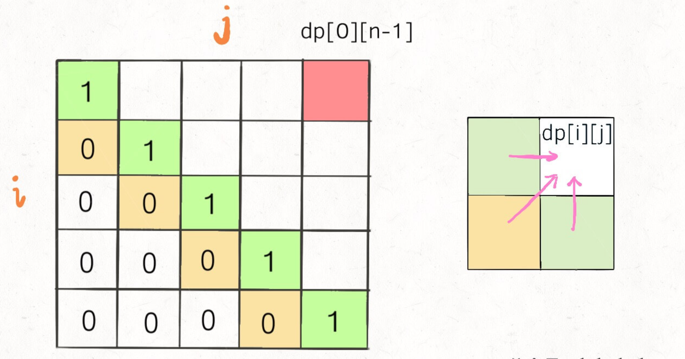
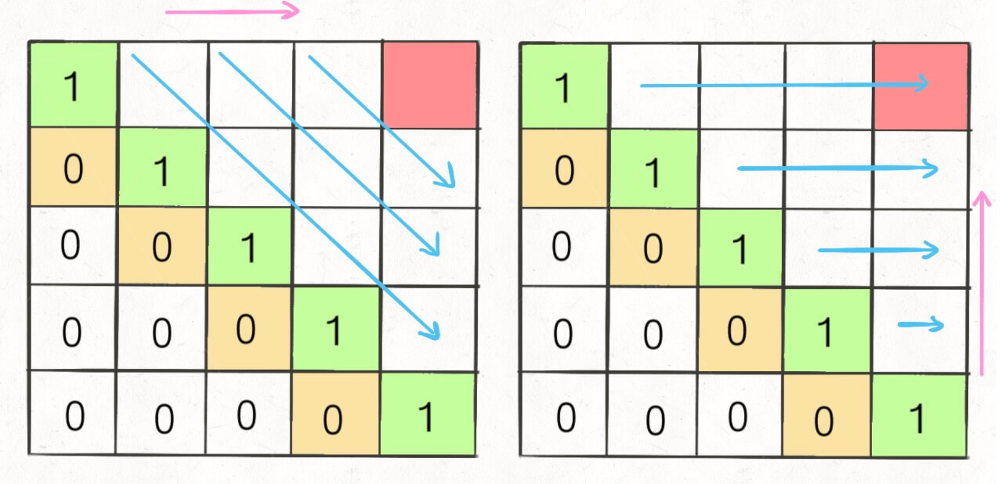

根据状态转移 写loop

你只要把住两点就行了：

1、遍历的过程中，所需的状态必须是已经计算出来的。

2、遍历的终点必须是存储结果的那个位置。(如何知道终点位置？从状态转移方程)

正向遍历：

int[][] dp = new int[m][n];

for (int i = 0; i < m; i++)

    for (int j = 0; j < n; j++)
    
        // 计算 dp[i][j]
        
 
 反向遍历:
 
 for (int i = m - 1; i >= 0; i--)
    
    for (int j = n - 1; j >= 0; j--)
    
        // 计算 dp[i][j]
        
斜向遍历：

// 斜着遍历数组

for (int l = 2; l <= n; l++) {
    
    for (int i = 0; i <= n - l; i++) {
    
        int j = l + i - 1;
        // 计算 dp[i][j]
    }
}

